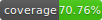

# storefront-app

Dropezy Storefront mobile app developed in Flutter.

# Getting started



In order to run the app on your local development machine, make sure you have performed these steps:

1) Setting up a Github Personal Access Token as described in [Developer Onboarding doc](https://dropezy.atlassian.net/wiki/spaces/DROPEZY/pages/4489217/Developer+Onboarding#Access-Token). This step is necessary even if you are using SSH keys, because there are dependencies on other Dropezy Dart packages which uses HTTPS connection. (see `pubspec.yaml`)
2) Perform Firebase Setup and Environment Variables as described below.
3) Additionally if you need to test Firebase Auth features, we recommend using [Firebase Auth Emulator](https://dropezy.atlassian.net/wiki/spaces/STOR/pages/6619165/Firebase+Auth+Emulator).


## Firebase Setup

Create a new project on your Firebase Console for development purposes.

Setup is done using manual installation as described on [FlutterFire docs](https://firebase.flutter.dev/docs/manual-installation).

### Android

1. Download `google-services.json` from Dropezy Android App on Firebase Console.
2. Put the file in `android/app/google-services.json`.

### iOS

1. Download `GoogleService-Info.plist` from Dropezy iOS App on Firebase Console.
2. Put the file in `ios/GoogleService-Info.plist`.
3. Create a Xcode Configuration file for Firebase in `Flutter/Firebase.xcconfig`. For quick setup, copy `Flutter/Firebase.xcconfig.example` with this command:

```bash
cp ./ios/Flutter/Firebase.xcconfig.example ./ios/Flutter/Firebase.xcconfig
```

---

**Q: Why not use Dart initialization (FlutterFire CLI)?**

A: There is an issue with Dart initialization when running on physical iOS device. See this [issue](https://github.com/FirebaseExtended/flutterfire/issues/7983).

## Setting up Environment Variables

Environment variables are loaded using [flutter_dotenv](https://pub.dev/packages/flutter_dotenv) package.

Create a file named `env/.env` in your local repository. This file should not be commited and
is added into `.gitignore`.

To quickly setup your local environment, copy the `env.example` file with this command:

```bash
cp ./env/.env.example ./env/.env
```

Then make changes as necessary.

In the Flutter App, all references to environment variables are placed in classes inside `lib/core/config` directory
and divided according to their domain for easier maintenance.

## Pre-push checks

We have set up Git hooks to prevent extra whitespace and other possible mistakes before pushing the code to your branch. Run the below command in the project root directory to copy the pre-push hooks to your local `.git` directory.

```bash
  cp ./hooks/pre-push.example ./.git/hooks/pre-push
```

## Using res Folder

Please add any resource to the appropriate file in `res` folder and use your variable via importing `package:storefront_app/core/utils/build_context.ext.dart`. Example usage of string will be `context.res.strings.superEasyWithDropezy`
