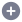

# Icon SVGs for generating icon font

The icon SVGs will be maintained here just incase we need a fresh build of icon font.

## Usage

```dart
const Icon(DropezyIcons.search, size: 18)
```

## Icon List

| Name                     |  Icon                    |
:-------------------------:|:-------------------------:
announcement | 
announcement_outlined | 
back | 
bell | 
best_seller | 
cart | 
check | 
check_on | 
check_off | 
chevron_down | 
chevron_left | 
cross | 
cross_circled | 
deals | 
deals_outlined | 
delivery | 
document | 
edit | 
flash | 
heart_alt | 
help | 
history | 
home | 
home_filled | 
lock | 
logo | 
language | 
map | 
minus | 
minus_circle_filled | 
note | 
package | 
paper | 
pin | 
pin_outlined | 
plus | 
plus_circle_filled | 
profile | 
profile_filled | 
promo | 
promo_filled | 
radio | 
radio_checked | 
search | 
search_alt | 
share | 
shield_done | 
sort | 
support | 
time | 
trash | 
voucher | 
voucher_outlined | 
whatsapp | 

> Note: **Do not** add this path to *pubspec.yaml*
